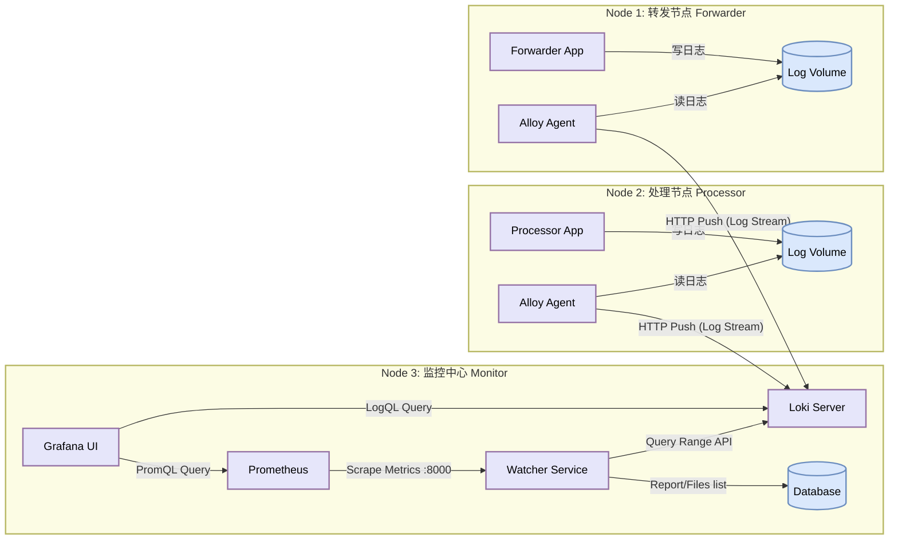
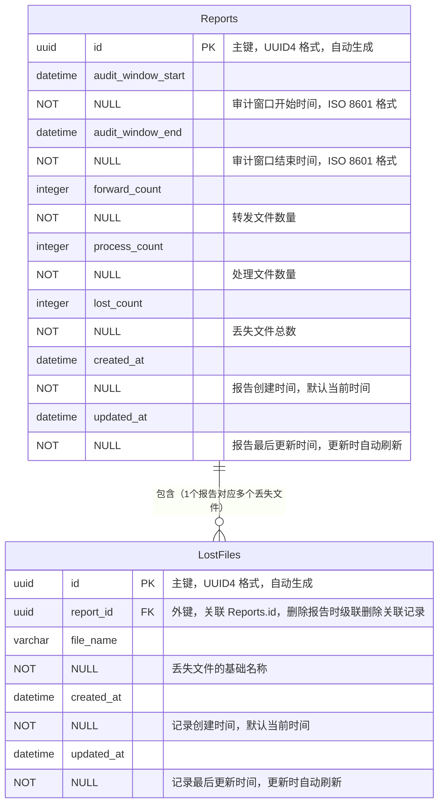

# plg-direct-demo

基于 **~~PLG~~ ALG (Alloy + Loki + Grafana)** 技术栈构建的数据治理与监控演示平台。


## Release Notes

### V5.0
本版本有下面的主要更改:
1. 迁移Promtail(即将EoL)到更新的通用探针Alloy上
2. 在探针节点上实现了采集端侧的日志清洗和解析
3. 清理了不再维护的分离节点部署方式的配置文件
4. 更新了基础日志数据格式,使其更加贴近生产环境
5. 重构了forwarder和processor,现在两个服务使用HTTP传输生成的一致文件名,而不是各自生成模拟数据.同时解耦的同时具有更好的可扩展性.
6. 引入了watcher容器,用于定时使用loki查询指定时间段的丢失情况,并生成丢失文件名列表.
7. 引入了mysql模拟数据库,用于存储watcher生成的报告和文件名列表.构建了基于SQLalchemy的watcher数据模型.

### V4.0
本版本在v3.0的基础上更新框架到3.9.0,通过引入配置增大了流量窗口以应对大历史流量冲击,同时尝试了在采集节点进行过滤和转换(未成功),并在同一个分支中支持单物理节点/多物理节点的部署方式.

### V3.0

本版本在V2.0的基础上支持了物理多节点的部署,并通过为转发节点增加并发支持消除了TPS设置和实际生产的差距.此外还有一系列易于部署的改进.

### V2.0

本版本在 v1.0 的基础上进行了架构升级，将单机模拟演进为**容器化分布式架构**。模拟了“转发服务”、“处理服务”和“监控中心”分别运行在独立的容器（逻辑节点）中，通过 Sidecar 模式进行日志采集，更贴近真实的生产环境部署形态。

## 分布式架构概览

本项目利用 Docker Compose 编排了 3 个逻辑节点，模拟跨服务器的数据生成,流转与监控。



### 核心组件

1. **业务计算层 (Data Plane)**:
    * **Forwarder Node**: 运行缓存转发服务，模拟上游数据入口。
    * **Processor Node**: 运行预处理服务，模拟下游数据出口（包含并发处理与丢包模拟）。
    * 两个服务完全解耦，分别运行在不同的容器网络命名空间中。
2. **数据采集层 (Collection Plane)**:
    * 采用 **Sidecar模式**。每个业务容器搭配一个独立的 Alloy 容器。
    * 模拟了在不同物理机上部署 Agent 的场景，Alloy 负责进行前置日志清洗过滤,并传送给Loki进行存储和处理。
3. **监控存储层 (Observability Plane)**:
    * **Loki**: 集中接收来自不同节点的日志流。
    * **Grafana**: 统一可视化展示。
    * **watcher**: 通过调用Loki查询,得到可配置时间段内丢失文件数目和列表,并生成对账报告和丢失文件列表落库持久化存储
    * **mysql**: 通用的sql后端,用于存储watcher生成的对账结果

---

## 部署和配置

> [!IMPORTANT]
> 从V5版本开始,该项目仅支持在单机节点上进行部署和维护,分离节点模式的配置已经移除.

解包并导入镜像(仅限离线节点)

```shell
docker load -i python312.tar
docker load -i alloy.tar
docker load -i loki.tar
docker load -i grafana.tar
docker load -i prometheus.
#...
```

### 部署
启动整个服务

```shell
docker compose  up -d --build #如果有代码更改,重新进行构建
```

即可直接进入grafana进行dashboard导入和配置.

## 部署和配置

以下内容提供快速配置步骤与常用调优建议，适用于本项目的本地开发/测试环境。

### 先决条件
- 已安装 Docker 与 Docker Compose
- 在 Linux 环境下，检查宿主卷权限以避免权限问题

### 快速启动
```bash
# 构建并后台启动所有服务
docker compose up -d --build

# 查看服务状态与日志
docker compose ps
docker compose logs -f grafana
```
在grafana-dashboard中手动导入`dashboards/dashboard.json`

### 关键配置与位置
- `docker-compose.yaml`（常用环境变量）
  - Forwarder: `APP_TPS`、`APP_PROCESSOR_URL`
  - Processor: `APP_LOSS_RATE`
  - Watcher: `LOKI_URL`、`CHECK_INTERVAL_SECONDS`、`WINDOW_OFFSET_SECONDS`、`DB_*` 连接变量
- Alloy: 编辑 `./config/alloy-config.local.alloy` 调整 source/process 过滤规则
- Loki: 编辑 `./config/loki-config.local.yaml` 的 `limits_config`（`ingestion_rate_mb`、`ingestion_burst_size_mb`）以进行流量调优
- Grafana: ~~数据源与 dashboard 已通过 `./provisioning` 与 `./dashboards` 挂载，修改后重启 Grafana 生效~~仍需手动导入`.json`文件
- MySQL（TiDB 测试替代）：参见 `docker-compose.yaml` 中的环境变量与 healthcheck

### 调整与验证
- 压力测试：增大 `APP_TPS` 并相应调整 Loki 的 `ingestion_*` 限流参数以避免被限流
- 验证端点：
  - Grafana: http://localhost:3700
  - Loki: http://localhost:3100
  - Prometheus: http://localhost:9090
  - Watcher API: http://localhost:8000

### 常见故障与排查
- Grafana 登录失败：执行 `docker exec -it grafana grafana-cli admin reset-admin-password admin` 重置管理员密码
- Watcher 无法访问 Loki：确认 `LOKI_URL` 为 `http://loki:3100`，查看 `docker compose logs watcher` 获取详情
- MySQL 未就绪：查看 `docker compose logs mysql` 并等待 healthcheck 通过，确认用户/密码一致
- 卷权限问题：检查宿主机目录权限或在容器内使用 `ls -la` 查看挂载点

## 核心指标 LogQL

在分布式环境下，Loki 会自动聚合所有来源的日志，查询语句与单机版保持一致。

由于已经在采集端过滤了无关噪声日志,只需要进行简单的计数即可得到数据.

跨节点流量对比

```logql
sum(rate({service="forward_svc"} [1m])) 
sum(rate({service="process_svc"} [1m]))
```

跨节点丢包率 (Loss Rate)

```logql
(sum(rate({service="forward_svc"} [1m]))-sum(rate({service="process_svc"} [1m])))/sum(rate({service="forward_svc"} [1m]))
```

## V4: PLG架构调优

### Promtail端的速率配置

```yaml
# config/promtail-forwarder.example.yaml
limits_config:
  # 全局读取速率限制
  # 限制 Promtail 每秒最多读取多少行日志
  # 假设你的正常 TPS 是 2000，这里可以设为 3000-4000，允许一定追赶，但不允许无限爆发
  readline_rate: 4000
  
  # 突发大小 (Burst)，允许短时间内超过 rate 的数量
  readline_burst: 8000
  
  # 限制单行日志最大长度 (防止超大日志卡死)
  max_line_size: 256KB
```

### Loki端的速率配置
>
> [!TIP]
> 分离式部署和统一部署均使用`config/loki-config.local.yaml`

```yaml
#config/loki-config.local.yaml
limits_config:
  #enforce_metric_name: false # removed in Loki 3.x
  reject_old_samples: true
  ingestion_rate_strategy: "local" # 使用本地限流策略. Ref:https://cloud.tencent.com/developer/article/1822952
  reject_old_samples_max_age: 24h  # 拒绝1天前的日志样本

  # 摄入速率 (MB/s) - 这是“水管的粗细”
  ingestion_rate_mb: 20
  # 突发大小 (MB) - 这是“缓冲池的大小”
  # 关键点：将此值设得非常大！
  # 允许 Loki 在短时间内接收大量数据，只要平均速率不超过 rate 即可
  ingestion_burst_size_mb: 100  # 甚至可以设为 200MB
```

## V5: TiDB数据库存储丢失报告和文件列表

V5版本中使用MySQL兼容的TiDB存储watcher生成的丢失文件报告和文件列表.数据库结构如下:


