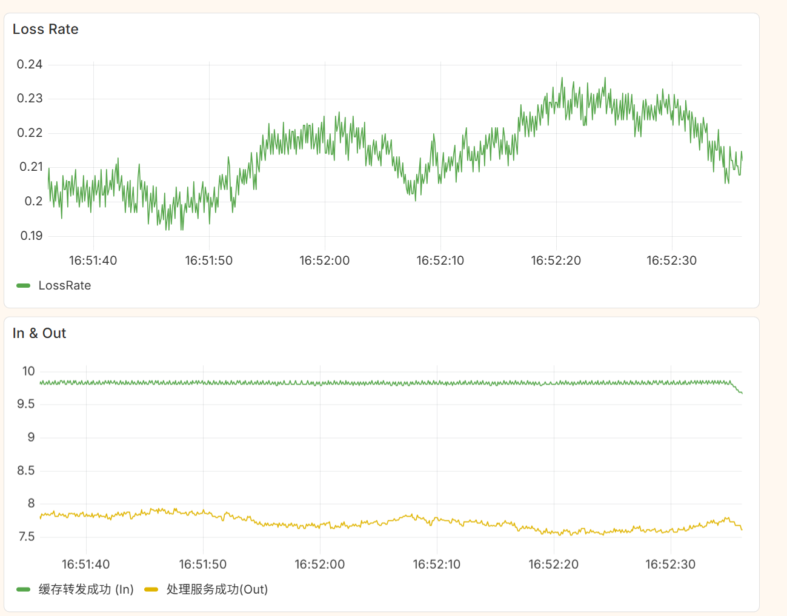
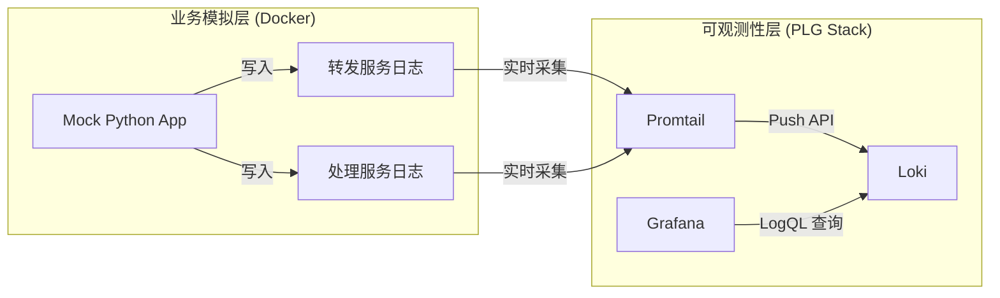

# plg-direct-demo
基于 **Promtail + Loki + Grafana (PLG)** 技术栈构建的轻量级数据治理与监控演示平台。

本项目模拟了一个典型的**异步微服务架构**（文件转发 -> 文件处理），演示了如何在**不修改业务代码**的情况下，仅通过采集和分析**非结构化文本日志**，实时监控业务核心指标（丢包率、吞吐量、处理时延）。

下图为设置丢包率为0.2，TPS为10的模拟环境中的观测结果。



## 架构概览

本项目采用 **"直读文件 (Direct File Read)"** 模式，模拟业务应用将日志写入磁盘，Promtail 实时采集并推送至 Loki，最终由 Grafana 进行聚合计算。


项目包含下面几个模块：
1. 业务模拟与数据生成模块 (Data Generation)
这是本项目的“数据源头”，负责模拟真实的业务流转场景。
    - 双服务架构模拟：模拟了 “缓存转发服务 (Forwarder)” 和 “预处理服务 (Processor)” 的上下游关系。
    - 非结构化日志输出：按照预设的文本格式，分别向两个独立的磁盘目录输出业务日志，模拟真实生产环境中的日志落地行为。
    - 高并发无瓶颈设计：采用 Python ThreadPoolExecutor (线程池) 架构实现消费端的并发处理。
关键特性：确保模拟器本身具有极高的吞吐能力，不存在内部处理瓶颈。配置中的“处理时延”仅由代码逻辑中的 sleep 精确控制，用于模拟业务耗时，而非程序性能不足导致的阻塞。
    - 全参数动态配置：支持通过环境变量动态调整 TPS (吞吐量)、Loss Rate (丢包率) 以及 Latency Range (随机时延范围)。
1. 日志采集与存储模块 (Promtail & Loki)
这是本项目的“数据管道”，构建了轻量级的 PLG 核心底座。
    - Promtail (采集)：配置为 "直读 (Direct Read)" 模式。它实时监听业务模拟模块输出的日志文件，利用 inotify 机制处理日志轮转 (Log Rotation)，并根据文件路径自动为日志流打上 service 等关键标签 (Labels)。
    - Loki (存储)：接收来自 Promtail 的日志流。作为轻量级日志引擎，它不建立全文索引，而是对标签进行索引，支持高写入吞吐，并提供强大的 LogQL 查询引擎供上层调用。
1. 可视化分析模块 (Grafana)负责数据的查询、聚合与展示。


> [!IMPORTANT]
> 本项目的核心监控指标是基于 **“同一时间窗口内”** 转发服务（入口）与处理服务（出口）的成功流量差值计算得出的。
>
> 在存在 **处理时延 (Latency)** 的场景下， $T_0$ 时刻进入系统的请求，通常会在 $T_0 + \Delta t$ 时刻才被处理完成并记录日志。因此，严格意义上的秒级实时匹配是无法完全精确的（会出现短暂的负值或波动）。
>
> 考虑到在实际生产环境中，业务数据流通常具有 **宏观平稳性 (Statistically Stable)**，在分钟级（如 `[1m]`）的滑动聚合窗口下，这种时延带来的统计误差会被平滑抵消。因此，该计算模型可以作为一段时间内 **丢包率 (Loss Rate)** 的有效工程估算，足以用于趋势监控和故障告警。


### 核心特性
- **非侵入式监控**：无需 SDK 埋点，直接解析磁盘上的文本日志。
- **实时指标计算**：利用 LogQL 从日志流中实时计算 **Loss Rate (丢包率)** 和 **Latency (时延)**。
- **动态场景模拟**：通过环境变量动态调整 TPS、故障率（丢包）和处理延迟，模拟生产环境的各种极端情况。
- **高并发模拟**：内置线程池模型，支持高吞吐量场景下的精准模拟。

---

## 快速开始

### 前置要求
*   Docker
*   Docker Compose

### 1. 启动服务
在项目根目录下执行：

```bash
# 构建镜像并启动所有服务
docker-compose up -d --build
```

### 2. 验证状态
确保所有容器均处于 `Up` 状态：

```bash
docker-compose ps
```

### 3. 访问监控面板
打开浏览器访问 Grafana：
*   **地址**: `http://localhost:3000`
*   **账号**: `admin`
*   **密码**: `admin`

---

> [!TIP]
> 本项目已实现 Grafana 的全自动化配置。Loki 数据源已通过 `provisioning` 目录预置，无需手动添加即可直接使用。同时，Grafana 的用户配置（如 Admin 账号密码）已通过 Docker Volume 实现持久化，重启服务后数据不会丢失。

## 配置说明

可以通过修改 `docker-compose.yaml` 中的环境变量来控制模拟器的行为，无需重启容器即可生效（Docker Compose 会自动重建应用容器）。

| 环境变量                 | 默认值 | 说明                                                            |
| :----------------------- | :----- | :-------------------------------------------------------------- |
| `APP_TPS`                | `20.0` | **目标吞吐量**。每秒产生的文件数量。                            |
| `APP_LOSS_RATE`          | `0.2`  | **丢包率** (0.0 - 1.0)。`0.2` 表示 20% 的文件在处理阶段会丢失。 |
| `APP_INTERFERENCE_DELAY` | `0.01` | **干扰日志延迟** (秒)。模拟 IO 耗时，控制日志生成的流量。       |
| `APP_MIN_LATENCY`        | `50`   | **最小处理耗时** (ms)。模拟业务处理的最小时间。                 |
| `APP_MAX_LATENCY`        | `500`  | **最大处理耗时** (ms)。模拟业务处理的最大时间。                 |

**修改示例：**
模拟高并发、高故障场景：
```yaml
environment:
  - APP_TPS=100.0
  - APP_LOSS_RATE=0.5
```

---

## 监控指标与 LogQL

本项目使用 LogQL 提取以下关键指标。可以在 Grafana 的 Explore 或 Dashboard 中使用这些查询。

### 1. 转发服务流入量 (Throughput In)
统计包含 `Rename trigger hard link` 的日志行数。

```logql
sum(rate({service="forward_svc"} |= "Rename trigger hard link" [1m]))
```

### 2. 处理服务完成量 (Throughput Out)
统计同时包含 `处理文件` 和 `成功` 的日志行数。

```logql
sum(rate({service="process_svc"} |= "处理文件" |= "成功" [1m]))
```

### 3. 实时丢包数量 (Loss Count)
计算流入与流出的差值（包含积压和丢失）。

```logql
sum(rate({service="forward_svc"} |= "Rename trigger hard link" [1m]))
-
sum(rate({service="process_svc"} |= "处理文件" |= "成功" [1m]))
```

### 4. 实时丢包率 (Loss Rate %)
计算丢失比例。**注意：** 在 Grafana Panel 中需将 Unit 设置为 `Percent (0.0-1.0)`。

```logql
(
  sum(rate({service="forward_svc"} |= "Rename trigger hard link" [1m]))
  -
  sum(rate({service="process_svc"} |= "处理文件" |= "成功" [1m]))
)
/
sum(rate({service="forward_svc"} |= "Rename trigger hard link" [1m]))
```

### 5. 平均处理耗时 (Average Latency)
使用正则提取日志中的 `耗时xx毫秒` 字段并计算平均值。

```logql
avg_over_time(
  {service="process_svc"} 
  |= "处理文件" 
  | regexp "耗时(?P<duration>\\d+)毫秒" 
  | unwrap duration 
  [1m]
)
```

---

## 项目结构

```text
.
├── docker-compose.yaml      # 容器编排与环境变量配置
├── promtail-config.yaml     # Promtail 采集规则配置
├── mock_text_log.py         # 业务模拟核心脚本 (Python)
├── Dockerfile               # 模拟应用镜像构建文件
└── logs/                    # [自动生成] 日志挂载目录
    ├── service-forward/     # 转发服务日志
    └── service-process/     # 处理服务日志
```

---

## 常见问题排查 (Troubleshooting)

### Q1: Grafana 显示 "No Data"？
1.  **检查日志文件**：确认 `logs/` 目录下是否有文件生成，且内容不为空。
2.  **检查时间范围**：Grafana 右上角时间范围请选择 `Last 5 minutes` 或 `Last 15 minutes`。
3.  **检查权限**：确保 Promtail 容器有权限读取宿主机的 `logs/` 目录（必要时执行 `chmod -R 777 logs/`）。

### Q2: 丢包率显示异常高（接近 100%）？
*   **原因**：可能是消费端处理能力不足导致积压。
*   **解决**：本项目已在 `mock_text_log.py` 中引入 `ThreadPoolExecutor` 实现并发处理。重新构建镜像 (`docker-compose up -d --build`)。

### Q3: 修改环境变量后没生效？
*   Docker Compose 需要重建容器才能应用新的环境变量。执行 `docker-compose up -d`（不需要 `--build`，除非修改了 Python 代码）。

---

## TODOs
- [ ] 增加预处理服务流入指标(标志为`解压文件filePath=...`)
- [ ] 进一步针对更多的预处理日志类型，增加每一个步骤的统计指标(待议)
