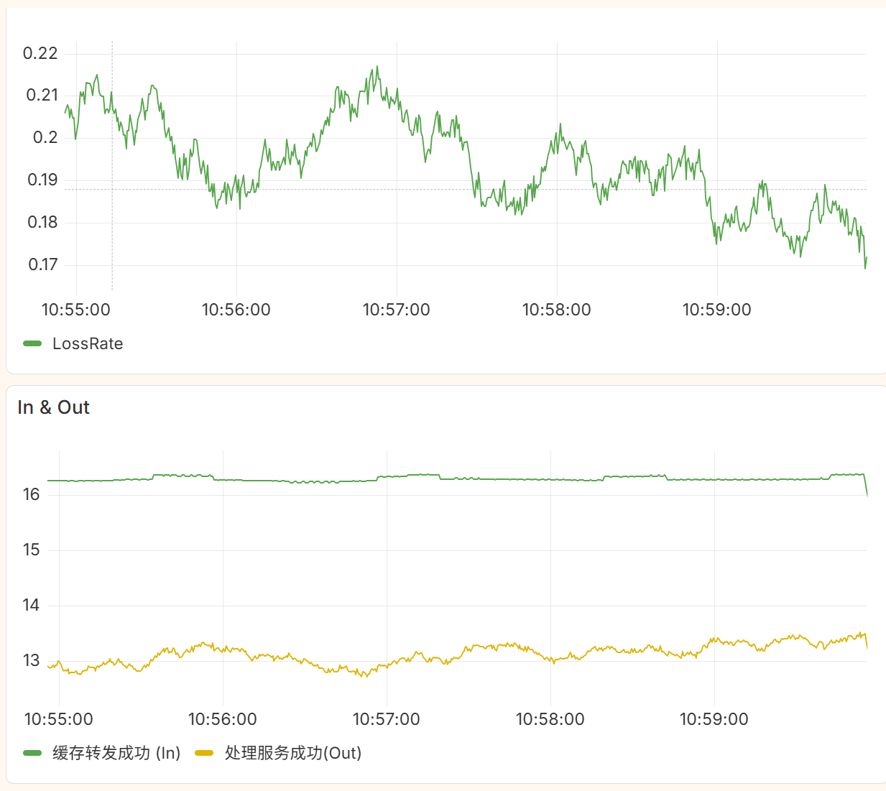
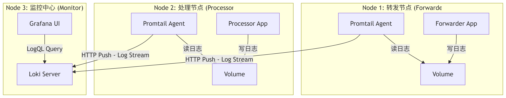
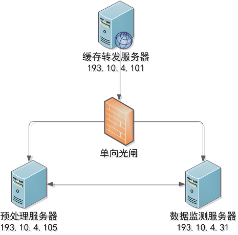

# plg-direct-demo

基于 **PLG (Promtail + Loki + Grafana)** 技术栈构建的**分布式微服务**数据治理与监控演示平台。



## Release Notes
### V3.0
本版本在V2.0的基础上支持了物理多节点的部署,并通过为转发节点增加并发支持消除了TPS设置和实际生产的差距.此外还有一系列易于部署的改进.
### V2.0
本版本在 v1.0 的基础上进行了架构升级，将单机模拟演进为**容器化分布式架构**。模拟了“转发服务”、“处理服务”和“监控中心”分别运行在独立的容器（逻辑节点）中，通过 Sidecar 模式进行日志采集，更贴近真实的生产环境部署形态。


## 分布式架构概览

本项目利用 Docker Compose 编排了 3 个逻辑节点（共 6 个容器），模拟跨服务器的数据流转与监控。



### 核心组件
1.  **业务计算层 (Data Plane)**:
    *   **Forwarder Node**: 运行缓存转发服务，模拟上游数据入口。
    *   **Processor Node**: 运行预处理服务，模拟下游数据出口（包含并发处理与丢包模拟）。
    *   *技术点*：两个服务完全解耦，分别运行在不同的容器网络命名空间中。
2.  **数据采集层 (Collection Plane)**:
    *   采用 **Sidecar模式**。每个业务容器搭配一个独立的 Promtail 容器。
    *   模拟了在不同物理机上部署 Agent 的场景，Promtail 负责为日志打上 `host` 和 `service` 标签。
3.  **监控存储层 (Observability Plane)**:
    *   **Loki**: 集中接收来自不同节点的日志流。
    *   **Grafana**: 统一可视化展示。

---

## 部署和配置

### 环境准备和验证

假设Demo部署在下面的网络拓扑上：
- 缓存转发节点`193.10.4.101`
- 预处理节点`193.10.4.105`
- 数据监测节点`193.10.4.31`

其中缓存转发节点对其余两个节点为单向连通，数据监测节点和预处理节点为双向连通。网络拓扑如下：



在部署之前需要具有下面的配置：
- docker
- docker-compose

> [!IMPORTANT]
> 上述服务均部署在默认端口,启动前需检查`docker-compose.yaml`中对应的端口是否被占用.

### 缓存转发节点

在缓存转发节点上解包并导入镜像
```shell
tar -xzvf plg-direct-demo-dis-xg_dis_demo.tar.gz && cd plg-direct-demo-dis-xg_dis_demo/docker/images

docker load -i python312.tar
docker load -i promtail.tar
```

复制`config`中的配置并填写url字段:
```shell
cp config/promtail-forwarder.example.yaml config/promtail-forwarder.yaml
```

启动集群

```bash
docker compose -f docker/docker-compose.forwarder.yaml up -d --build 
# 使用--build如第一次构建、涉及mockapp的更改
```

### 预处理节点
在预处理节点上解包并导入镜像
```shell
tar -xzvf plg-direct-demo-dis-xg_dis_demo.tar.gz && cd plg-direct-demo-dis-xg_dis_demo/docker/images

docker load -i python312.tar
docker load -i promtail.tar
```
复制`config`中的配置并填写url字段:
```shell
cp config/promtail-forwarder.example.yaml config/promtail-forwarder.yaml
```

启动集群

```bash
docker compose -f docker/docker-compose.processor.yaml up -d --build 
# 使用--build如第一次构建、涉及mockapp的更改
```

### 数据监控治理节点
在数据监控节点上解包并导入镜像
```shell
tar -xzvf plg-direct-demo-dis-xg_dis_demo.tar.gz && cd plg-direct-demo-dis-xg_dis_demo/docker/images

docker load -i loki.tar
docker load -i grafana.tar
```
启动集群
```shell
docker compose -f docker/docker-compose.monitor.yaml up -d --build
```

访问监控大屏：
*   **地址**: `http://<ip>:3700`(这里参照`docker/docker-compose.monitor.yaml`中的配置端口)
*   **账号**: `admin`
*   **密码**: `admin`


在进入Grafana之后，选择dashboard-Import Dashboard，上传`dashboard.json`，并配置数据源为Loki，即可得到预配置的数据大屏。

## 动态配置 (Environment Variables)

可以通过修改 `docker-compose.yaml` 中的环境变量来控制不同节点的行为。

### 转发节点 (Forwarder Node)
| 变量名     | 默认值      | 说明                                 |
| :--------- | :---------- | :----------------------------------- |
| `APP_ROLE` | `forwarder` | **必须**。指定当前容器运行转发逻辑。 |
| `APP_TPS`  | `20.0`      | 生产数据的速率 (TPS)。               |

### 处理节点 (Processor Node)
| 变量名          | 默认值      | 说明                                                  |
| :-------------- | :---------- | :---------------------------------------------------- |
| `APP_ROLE`      | `processor` | **必须**。指定当前容器运行处理逻辑。                  |
| `APP_TPS`       | `20.0`      | 消费/处理数据的基准速率。                             |
| `APP_LOSS_RATE` | `0.2`       | **丢包率**。模拟 20% 的数据在跨节点传输或处理中丢失。 |


## 验证分布式监控

如何证明数据确实来自不同的节点？

1.  进入 Grafana 左侧菜单的 **Explore**。
2.  选择 **Loki** 数据源。
3.  运行查询：`{job="file_pipeline"}`。
4.  查看日志的 **Labels (标签)** 字段：
    *   `host="node_1_forwarder"`：来自转发容器的数据。
    *   `host="node_2_processor"`：来自处理容器的数据。
    *   `service`：区分了具体的服务类型。

---

## 核心指标 LogQL

在分布式环境下，Loki 会自动聚合所有来源的日志，查询语句与单机版保持一致。

### 1. 跨节点流量对比
```logql
sum(rate({service="forward_svc"} |= "Rename trigger hard link" [1m]))
# vs
sum(rate({service="process_svc"} |= "处理文件" |= "成功" [1m]))
```

### 2. 跨节点丢包率 (Loss Rate)
```logql
(
  sum(rate({service="forward_svc"} |= "Rename" [1m]))
  -
  sum(rate({service="process_svc"} |= "成功" [1m]))
)
/
sum(rate({service="forward_svc"} |= "Rename" [1m]))
```


## 技术实现细节

### 1. 业务解耦与模拟策略
在 v2.0 中，转发服务与处理服务运行在完全隔离的容器中，无法通过内存队列通信。
*   **模拟原理**：采用 **统计学模拟 (Statistical Simulation)**。
*   **实现**：两个服务独立运行，但共享相同的 `TPS` 配置基准。处理服务通过 `LOSS_RATE` 参数，在数学概率上模拟出相对于转发服务的“数据丢失”效果。这种方式既保证了监控曲线的真实性，又避免了引入 Kafka/Redis 等重型中间件，保持了 Demo 的轻量级。

### 2. Sidecar 采集模式
本项目演示了 Kubernetes 中常见的 Sidecar 模式：
*   业务容器将日志写入 `Docker Volume` (模拟本地磁盘)。
*   Promtail 容器挂载同一个 Volume，实时读取日志。
*   这种方式实现了**业务与监控的物理分离**，业务容器无需感知 Promtail 的存在。


## 故障排查

**Q: Grafana 提示 "Login failed"？**
*   如果之前运行过旧版本，旧的数据库可能残留了旧密码。
*   **解决**：执行 `docker exec -it grafana grafana-cli admin reset-admin-password admin` 强制重置密码。

**Q: 只有转发数据，没有处理数据？**
*   检查 `processor-app` 容器是否启动。
*   检查 `docker-compose.yaml` 中 `processor-app` 的 `APP_ROLE` 是否设置为 `processor`。