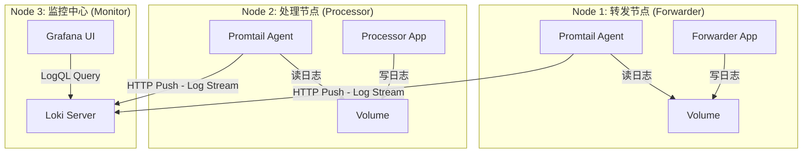

# plg-direct-demo

基于 **PLG (Promtail + Loki + Grafana)** 技术栈构建的**分布式微服务**数据治理与监控演示平台。


## Release Notes
### V2.0
本版本在 v1.0 的基础上进行了架构升级，将单机模拟演进为**容器化分布式架构**。模拟了“转发服务”、“处理服务”和“监控中心”分别运行在独立的容器（逻辑节点）中，通过 Sidecar 模式进行日志采集，更贴近真实的生产环境部署形态。

> [!NOTE]
> Powered by Gemini3pro-preview

## 分布式架构概览

本项目利用 Docker Compose 编排了 3 个逻辑节点（共 6 个容器），模拟跨服务器的数据流转与监控。



### 核心组件
1.  **业务计算层 (Data Plane)**:
    *   **Forwarder Node**: 运行缓存转发服务，模拟上游数据入口。
    *   **Processor Node**: 运行预处理服务，模拟下游数据出口（包含并发处理与丢包模拟）。
    *   *技术点*：两个服务完全解耦，分别运行在不同的容器网络命名空间中。
2.  **数据采集层 (Collection Plane)**:
    *   采用 **Sidecar模式**。每个业务容器搭配一个独立的 Promtail 容器。
    *   模拟了在不同物理机上部署 Agent 的场景，Promtail 负责为日志打上 `host` 和 `service` 标签。
3.  **监控存储层 (Observability Plane)**:
    *   **Loki**: 集中接收来自不同节点的日志流。
    *   **Grafana**: 统一可视化展示。

---

## 快速开始

### 1. 启动分布式集群
在项目根目录下执行：

```bash
# 构建镜像并启动所有容器
docker-compose up -d --build
```

### 2. 检查集群状态
确保 6 个容器均处于 `Up` 状态：

```bash
docker-compose ps
```
*   `forwarder-app` & `promtail-forwarder`
*   `processor-app` & `promtail-processor`
*   `loki` & `grafana`

### 3. 访问监控大屏
*   **地址**: `http://localhost:3000`
*   **账号**: `admin`
*   **密码**: `admin`

> [!TIP]
> **自动化配置**：Loki 数据源已预置，Grafana 用户数据已持久化。首次启动后无需手动配置数据源。

---

## 动态配置 (Environment Variables)

可以通过修改 `docker-compose.yaml` 中的环境变量来控制不同节点的行为。

### 转发节点 (Forwarder Node)
| 变量名     | 默认值      | 说明                                 |
| :--------- | :---------- | :----------------------------------- |
| `APP_ROLE` | `forwarder` | **必须**。指定当前容器运行转发逻辑。 |
| `APP_TPS`  | `20.0`      | 生产数据的速率 (TPS)。               |

### 处理节点 (Processor Node)
| 变量名          | 默认值      | 说明                                                  |
| :-------------- | :---------- | :---------------------------------------------------- |
| `APP_ROLE`      | `processor` | **必须**。指定当前容器运行处理逻辑。                  |
| `APP_TPS`       | `20.0`      | 消费/处理数据的基准速率。                             |
| `APP_LOSS_RATE` | `0.2`       | **丢包率**。模拟 20% 的数据在跨节点传输或处理中丢失。 |

> [!IMPORTANT]
> **关于 TPS 配置与实际丢包率的偏差**
>
> 在容器化环境中，**转发服务**受限于 IO 开销，其实际产出速率往往略低于配置的 `APP_TPS`（例如配置 20，实测约 16.5）。而**处理服务**因逻辑轻量，能精准达到配置速率。
>
> 这会导致 Grafana 计算出的丢包率低于预期（例如配置 20% 丢包，实际显示 4%）。
> **调优建议**：观察 Grafana 中转发服务的**实际 TPS**（如 16.5），将处理服务的 `APP_TPS` 环境变量**下调至该数值**，即可对齐基准，获得精准的丢包率演示效果。
> 更多计算见关于模拟数据的偏差说明小节


## 项目结构

```text
.
├── docker-compose.yaml        # 分布式编排核心文件
├── mock_async.py           # 业务逻辑脚本 (支持多角色切换)
├── Dockerfile                 # 应用镜像构建
├── config/
│   ├── promtail-forwarder.yaml  # 节点1 (转发) 采集配置
│   └── promtail-processor.yaml  # 节点2 (处理) 采集配置
└── logs/                      # (仅用于开发调试，运行时数据在 Docker Volume 中)
```

---

## 验证分布式监控

如何证明数据确实来自不同的节点？

1.  进入 Grafana 左侧菜单的 **Explore**。
2.  选择 **Loki** 数据源。
3.  运行查询：`{job="file_pipeline"}`。
4.  查看日志的 **Labels (标签)** 字段：
    *   `host="node_1_forwarder"`：来自转发容器的数据。
    *   `host="node_2_processor"`：来自处理容器的数据。
    *   `service`：区分了具体的服务类型。

---

## 核心指标 LogQL

在分布式环境下，Loki 会自动聚合所有来源的日志，查询语句与单机版保持一致。

### 1. 跨节点流量对比
```logql
sum(rate({service="forward_svc"} |= "Rename trigger hard link" [1m]))
# vs
sum(rate({service="process_svc"} |= "处理文件" |= "成功" [1m]))
```

### 2. 跨节点丢包率 (Loss Rate)
```logql
(
  sum(rate({service="forward_svc"} |= "Rename" [1m]))
  -
  sum(rate({service="process_svc"} |= "成功" [1m]))
)
/
sum(rate({service="forward_svc"} |= "Rename" [1m]))
```


## 技术实现细节

### 1. 业务解耦与模拟策略
在 v2.0 中，转发服务与处理服务运行在完全隔离的容器中，无法通过内存队列通信。
*   **模拟原理**：采用 **统计学模拟 (Statistical Simulation)**。
*   **实现**：两个服务独立运行，但共享相同的 `TPS` 配置基准。处理服务通过 `LOSS_RATE` 参数，在数学概率上模拟出相对于转发服务的“数据丢失”效果。这种方式既保证了监控曲线的真实性，又避免了引入 Kafka/Redis 等重型中间件，保持了 Demo 的轻量级。

### 2. Sidecar 采集模式
本项目演示了 Kubernetes 中常见的 Sidecar 模式：
*   业务容器将日志写入 `Docker Volume` (模拟本地磁盘)。
*   Promtail 容器挂载同一个 Volume，实时读取日志。
*   这种方式实现了**业务与监控的物理分离**，业务容器无需感知 Promtail 的存在。


## 故障排查

**Q: Grafana 提示 "Login failed"？**
*   如果之前运行过旧版本，旧的数据库可能残留了旧密码。
*   **解决**：执行 `docker exec -it grafana grafana-cli admin reset-admin-password admin` 强制重置密码。

**Q: 只有转发数据，没有处理数据？**
*   检查 `processor-app` 容器是否启动。
*   检查 `docker-compose.yaml` 中 `processor-app` 的 `APP_ROLE` 是否设置为 `processor`。

##  关于模拟数据的偏差说明 (Simulation Deviation)

在分布式容器化部署模式下，您可能会观察到 Grafana 显示的 **实际丢包率 (Actual Loss Rate)** 低于 `docker-compose.yaml` 中配置的 `APP_LOSS_RATE`。

### 现象示例
*   **配置**：`APP_TPS=20.0`, `APP_LOSS_RATE=0.2` (预期 20% 丢包)。
*   **监控显示**：丢包率仅为 **3% - 5%** 左右。

### 原因分析
这是由于两个独立容器的**运行基准不匹配**导致的：

1.  **转发服务 (Forwarder)**：
    *   虽然配置了 `TPS=20`，但由于 Python 脚本执行开销、Docker 容器的文件 IO 写入延迟以及代码中模拟的 `interference_delay`，导致其**实际产出速率**往往低于理论值（实测约 **16.3 TPS**）。
2.  **处理服务 (Processor)**：
    *   该服务的循环逻辑主要负责分发任务到线程池，IO 阻塞极少，因此它能非常精准地以 `TPS=20` 的基准运行。
    *   其输出量计算逻辑为：`基准 TPS (20) * (1 - LossRate 0.2) = 16.0 TPS`。

**结果偏差**：
监控系统计算的丢包率为：
$$ \frac{\text{实际输入}(16.3) - \text{模拟输出}(16.0)}{\text{实际输入}(16.3)} \approx \mathbf{1.8\%} $$
这导致原本预期的 20% 差距被“实际性能损耗”意外填平了。

### 调优建议
为了获得精准的演示效果，建议**手动对齐**两个服务的基准速率。

**方法**：观察 Grafana 中 `Forwarder` 的实际 TPS 线（例如稳定在 16.5），然后将 `docker-compose.yaml` 中 `processor-app` 的 `APP_TPS` 下调至该数值。

```yaml
  processor-app:
    environment:
      - APP_ROLE=processor
      - APP_TPS=16.5  # <--- 根据 Forwarder 的实际表现进行微调 (原为 20.0)
      - APP_LOSS_RATE=0.2
```
调整后，处理服务的输出将变为 $16.5 \times 0.8 = 13.2$，计算出的丢包率将回归至 $(16.5 - 13.2) / 16.5 = \mathbf{20\%}$。