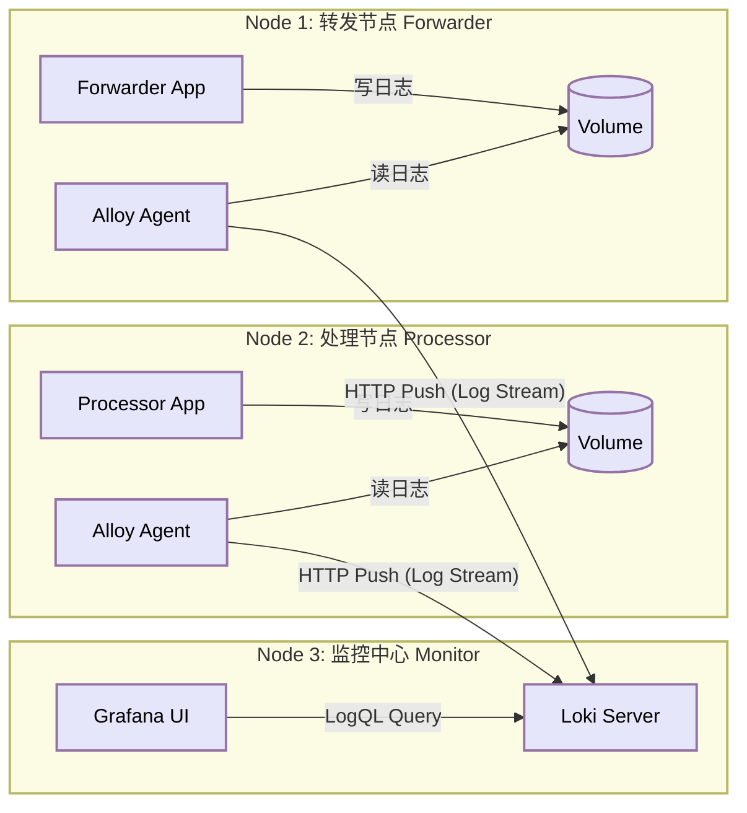
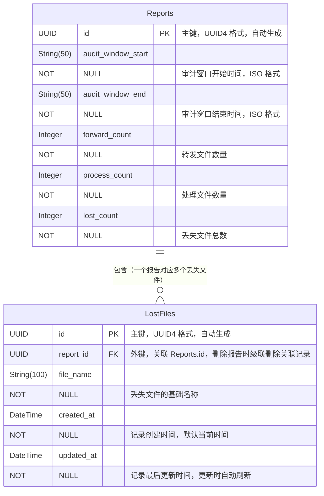

# plg-direct-demo

基于 **PLG (Promtail + Loki + Grafana)** 技术栈构建的**分布式微服务**数据治理与监控演示平台。


## Release Notes

### V4.0

本版本在v3.0的基础上更新框架到3.9.0,通过引入配置增大了流量窗口以应对大历史流量冲击,同时尝试了在采集节点进行过滤和转换(未成功),并在同一个分支中支持单物理节点/多物理节点的部署方式.

### V3.0

本版本在V2.0的基础上支持了物理多节点的部署,并通过为转发节点增加并发支持消除了TPS设置和实际生产的差距.此外还有一系列易于部署的改进.

### V2.0

本版本在 v1.0 的基础上进行了架构升级，将单机模拟演进为**容器化分布式架构**。模拟了“转发服务”、“处理服务”和“监控中心”分别运行在独立的容器（逻辑节点）中，通过 Sidecar 模式进行日志采集，更贴近真实的生产环境部署形态。

## 分布式架构概览

本项目利用 Docker Compose 编排了 3 个逻辑节点（共 6 个容器），模拟跨服务器的数据流转与监控。



### 核心组件

1. **业务计算层 (Data Plane)**:
    * **Forwarder Node**: 运行缓存转发服务，模拟上游数据入口。
    * **Processor Node**: 运行预处理服务，模拟下游数据出口（包含并发处理与丢包模拟）。
    * *技术点*：两个服务完全解耦，分别运行在不同的容器网络命名空间中。
2. **数据采集层 (Collection Plane)**:
    * 采用 **Sidecar模式**。每个业务容器搭配一个独立的 Alloy 容器。
    * 模拟了在不同物理机上部署 Agent 的场景，Alloy 负责为日志打上 `host` 和 `service` 标签。
3. **监控存储层 (Observability Plane)**:
    * **Loki**: 集中接收来自不同节点的日志流。
    * **Grafana**: 统一可视化展示。

---

## 部署和配置
>
> [!IMPORTANT]
> 部署在物理分离节点上和部署在单机测试环境使用两套不同配置,参考下面的章节注意区分.

### 部署在物理分离节点上

#### 环境准备和验证

假设Demo部署在下面的网络拓扑上：

* 缓存转发节点`193.10.4.101`
* 预处理节点`193.10.4.105`
* 数据监测节点`193.10.4.31`

其中缓存转发节点对其余两个节点为单向连通，数据监测节点和预处理节点为双向连通。网络拓扑如下：


在部署之前需要具有下面的配置：

* docker
* docker-compose

> [!IMPORTANT]
> 上述服务均部署在默认端口,启动前需检查`docker-compose.yaml`中对应的端口是否被占用.

#### 缓存转发节点

在缓存转发节点上解包并导入镜像(仅限离线节点)

```shell
tar -xzvf plg-direct-demo-dis-xg_dis_demo.tar.gz && cd plg-direct-demo-dis-xg_dis_demo/docker/images

docker load -i python312.tar
docker load -i alloy.tar
```

修改`alloy-config.local.alloy`中`local_loki`字段的`url`字段为loki节点的IP

启动集群

```bash
docker compose -f docker/docker-compose.forwarder.yaml up -d --build 
# 使用--build如第一次构建、涉及mockapp的更改
```

#### 预处理节点

在预处理节点上解包并导入镜像(仅限离线节点)

```shell
tar -xzvf plg-direct-demo-dis-xg_dis_demo.tar.gz && cd plg-direct-demo-dis-xg_dis_demo/docker/images

docker load -i python312.tar
docker load -i alloy.tar # 待上传 或可以自己打包
```

修改`alloy-config.local.alloy`中`local_loki`字段的`url`字段为loki节点的IP

启动集群

```bash
docker compose -f docker/docker-compose.processor.yaml up -d --build 
# 使用--build如第一次构建、涉及mockapp的更改
```

#### 数据监控治理节点

在数据监控节点上解包并导入镜像(仅限离线节点)

```shell
tar -xzvf plg-direct-demo-dis-xg_dis_demo.tar.gz && cd plg-direct-demo-dis-xg_dis_demo/docker/images

docker load -i loki.tar
docker load -i grafana.tar
```

启动集群

```shell
docker compose -f docker/docker-compose.monitor.yaml up -d --build
```

访问监控大屏：

* **地址**: `http://<ip>:3700`(这里参照`docker/docker-compose.monitor.yaml`中的配置端口)
* **账号**: `admin`
* **密码**: `admin`

访问alloy的在线调试GUI:`http://[节点IP]:12345`

在进入Grafana之后，选择dashboard-Import Dashboard，上传`dashboard.json`，并配置数据源为Loki，即可得到预配置的数据大屏。

### 部署在单一节点上

如果部署在单机上作为测试环境,可以参考下面的配置方法.

解包并导入镜像(仅限离线节点)

```shell
docker load -i python312.tar
docker load -i alloy.tar
docker load -i loki.tar
docker load -i grafana.tar
```

直接使用预定义的`docker-compose.local.yaml`启动整个服务

```shell
docker compose -f docker/docker-compose.local.yaml up -d --build 
```

即可直接进入grafana进行dashboard导入和配置.

## 动态配置 (Environment Variables)

可以通过修改 `docker-compose.yaml` 中的环境变量来控制不同节点的行为。

> [!TIP]
> 为保证观测数据不至于发生偏移,在`worker=20`下,不建议TPS超过70.理论最大吞吐量$TPS=\frac{threads\_num}{average\_timecost}=20/0.275\approx 72.7$

### 转发节点 (Forwarder Node)

| 变量名     | 默认值      | 说明                                 |
| :--------- | :---------- | :----------------------------------- |
| `APP_ROLE` | `forwarder` | **必须**。指定当前容器运行转发逻辑。 |
| `APP_TPS`  | `20.0`      | 生产数据的速率 (TPS)。               |

### 处理节点 (Processor Node)

| 变量名          | 默认值      | 说明                                                  |
| :-------------- | :---------- | :---------------------------------------------------- |
| `APP_ROLE`      | `processor` | **必须**。指定当前容器运行处理逻辑。                  |
| `APP_TPS`       | `20.0`      | 消费/处理数据的基准速率。                             |
| `APP_LOSS_RATE` | `0.2`       | **丢包率**。模拟 20% 的数据在跨节点传输或处理中丢失。 |

## 核心指标 LogQL

在分布式环境下，Loki 会自动聚合所有来源的日志，查询语句与单机版保持一致。

由于已经在采集端过滤了无关噪声日志,只需要进行简单的计数即可得到数据.

跨节点流量对比

```logql
sum(rate({service="forward_svc"} [1m])) 
sum(rate({service="process_svc"} [1m]))
```

跨节点丢包率 (Loss Rate)

```logql
(sum(rate({service="forward_svc"} [1m]))-sum(rate({service="process_svc"} [1m])))/sum(rate({service="forward_svc"} [1m]))
```

## 故障排查

**Q: Grafana 提示 "Login failed"？**

* 如果之前运行过旧版本，旧的数据库可能残留了旧密码。
* **解决**：执行 `docker exec -it grafana grafana-cli admin reset-admin-password admin` 强制重置密码。

## V4: PLG架构调优

### Promtail端的速率配置

```yaml
# config/promtail-forwarder.example.yaml
limits_config:
  # 全局读取速率限制
  # 限制 Promtail 每秒最多读取多少行日志
  # 假设你的正常 TPS 是 2000，这里可以设为 3000-4000，允许一定追赶，但不允许无限爆发
  readline_rate: 4000
  
  # 突发大小 (Burst)，允许短时间内超过 rate 的数量
  readline_burst: 8000
  
  # 限制单行日志最大长度 (防止超大日志卡死)
  max_line_size: 256KB
```

### Loki端的速率配置
>
> [!TIP]
> 分离式部署和统一部署均使用`config/loki-config.local.yaml`

```yaml
#config/loki-config.local.yaml
limits_config:
  #enforce_metric_name: false # removed in Loki 3.x
  reject_old_samples: true
  ingestion_rate_strategy: "local" # 使用本地限流策略. Ref:https://cloud.tencent.com/developer/article/1822952
  reject_old_samples_max_age: 24h  # 拒绝1天前的日志样本

  # 摄入速率 (MB/s) - 这是“水管的粗细”
  ingestion_rate_mb: 20
  # 突发大小 (MB) - 这是“缓冲池的大小”
  # 关键点：将此值设得非常大！
  # 允许 Loki 在短时间内接收大量数据，只要平均速率不超过 rate 即可
  ingestion_burst_size_mb: 100  # 甚至可以设为 200MB
```

## V5: TiDB数据库存储丢失报告和文件列表

V5版本中使用MySQL兼容的TiDB存储watcher生成的丢失文件报告和文件列表.数据库结构如下:



## V5: 测试环境下安装和部署TiDB

> [!NOTE]
> 该节准备合并到Installation章节中,在V5正式发布后

参考: <https://docs.pingcap.com/tidb/stable/quick-start-with-tidb/>

```shell
curl --proto '=https' --tlsv1.2 -sSf https://tiup-mirrors.pingcap.com/install.sh | sh
```

In a new terminal session:

```shell
tiup playground
```
